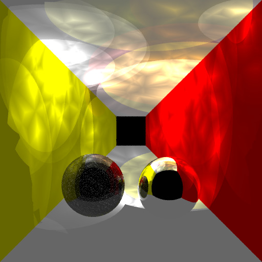

# Raytracer


[](https://sonarcloud.io/dashboard?id=sgooding_Raytracer)
[](https://sonarcloud.io/dashboard?id=sgooding_Raytracer)
[](https://sonarcloud.io/dashboard?id=sgooding_Raytracer)
[](https://sonarcloud.io/dashboard?id=sgooding_Raytracer)
[](https://sonarcloud.io/dashboard?id=sgooding_Raytracer)


Just a simple ray tracer program.

## Install
```
mkdir build
cd build
cmake ..
make
make install
```
## Run
```
cd ..
build/app/raytrace input.txt
```

## Results


## Deploy
```
mkdir build
cd build
cmake ..
make package
sudo dpkg -i Raytracker-*.deb

# uninstall
sudo dpkg -P raytracer
```

## Docker
```
docker run -it -v /local/dir:/container/dir:rw ghcr.io/sgooding/raytracer:latest bash
cd /container/dir
raytracer /usr/local/examples/5000_corrected_glass.txt
```
